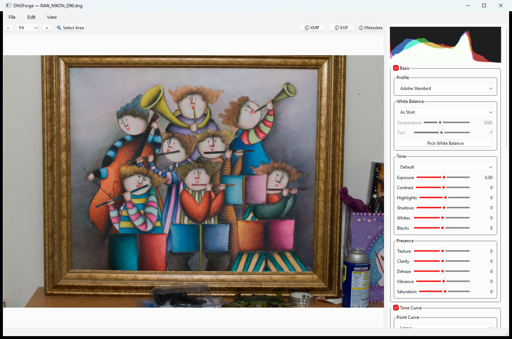

# DNGForge

Editor RAW non distruttivo per file DNG, in stile Lightroom/Camera Raw: bilanciamento del bianco,
curva tonale, saturazione/nitidezza, filtri radiale e graduato, rimozione macchie, correzione
obiettivo, crop/raddrizzamento, undo/redo, pannello metadati EXIF, filmstrip a galleria.

**Perché**: un'alternativa a costo zero all'abbonamento Lightroom, non un'alternativa ad Adobe come
tecnologia. DNGForge scrive le modifiche nei veri tag XMP `crs` di Adobe (Adobe DNG Converter è
gratuito, a differenza di Lightroom) — un file elaborato qui, aperto in un vero Lightroom, si
ritrova praticamente identico e ancora pienamente editabile, e viceversa. Nessun sidecar esterno:
il salvataggio scrive **sempre e solo dentro il DNG stesso**, requisito di progetto non
negoziabile.



## Come funziona

Ogni pixel mostrato o salvato viene renderizzato da **Adobe DNG Converter**, dipendenza runtime
obbligatoria (l'app rifiuta di aprire file se non lo trova): `DNGForge.pyw` costruisce solo i tag
XMP di editing e li passa al converter, non tocca mai i pixel direttamente.

Unica eccezione: i tre strumenti di editing locale — filtro radiale, filtro graduato e rimozione
macchie — non vengono renderizzati da Adobe DNG Converter (confermato non supportato dalla sua
CLI), quindi per quei tre soli strumenti l'app compone i pixel localmente (OpenCV/Pillow) sopra il
render Adobe.

## Stato / progetto collegato

[DNGForgeLab](https://github.com/milanone/DNGForgeLab) è un fork di questo progetto che sta
calibrando un motore di rendering nativo Python/rawpy, con l'obiettivo di arrivare un giorno a
un'indipendenza da Adobe DNG Converter.

## Requisiti

- Python 3.10+ e le dipendenze in `requirements.txt` (`pip install -r requirements.txt`)
- [Adobe DNG Converter](https://helpx.adobe.com/camera-raw/using/adobe-dng-converter.html)
  installato nel percorso standard Windows
- `exiftool` reale (binario, non solo libreria) versione ≥ 12.15

## Avvio

```
pythonw DNGForge.pyw [file.dng]
```

L'argomento (opzionale) carica un DNG all'avvio.

## Funzionalità principali

- Bilanciamento del bianco: color picker sul raw, preset, temperatura/tint colorimetrica
- Curva tonale personalizzata, saturazione, nitidezza
- Filtro radiale e graduato, multi-regione, con persistenza XMP compatibile Lightroom/ACR
- Rimozione macchie (spot removal)
- Correzione obiettivo (via `lensfunpy`)
- Crop e raddrizzamento
- Undo/redo (stack di 20 stati) + revert all'ultimo salvataggio
- Pannello metadati EXIF, filmstrip a galleria per navigare una cartella
- Copia/incolla impostazioni tra foto
- Istogramma RGB

## Struttura

- `DNGForge.pyw` — applicazione principale (un'unica classe `DNGForge(QMainWindow)`)
- `backups/` — versioni precedenti significative, tenute come riferimento
- `reference/` — codice di terzi consultato come riferimento (non incluso nel repo)
